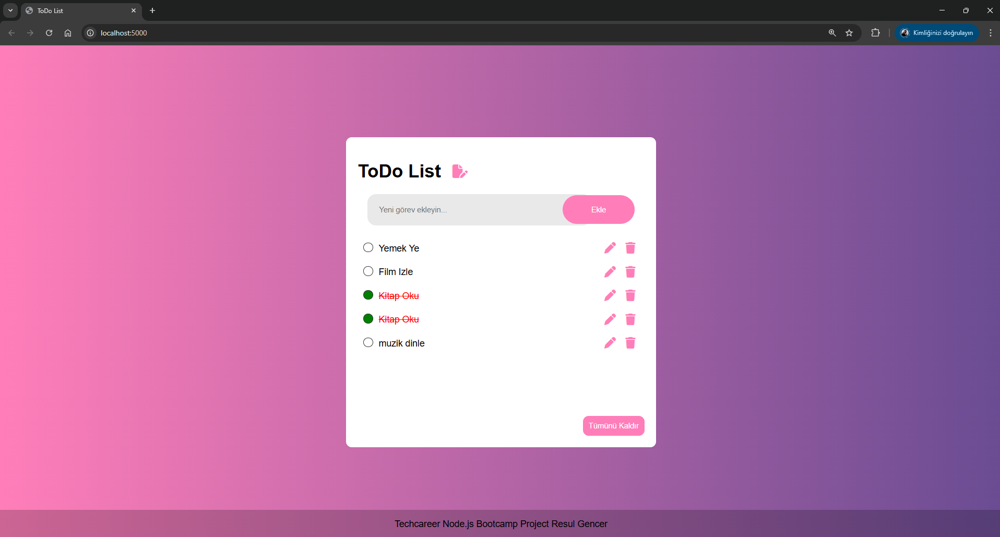

# ToDo List Uygulaması

Bu proje, kullanıcıların yapılacaklar listesi (ToDo List) oluşturup, yönetebileceği bir uygulamadır. Firebase veritabanı kullanarak verilerin saklanması sağlanmış ve Express.js ile backend yapılandırılmıştır. Uygulama, kullanıcıların görevlerini eklemelerini, düzenlemelerini, silmelerini ve tamamlandı olarak işaretlemelerini sağlar.

## Kullanılan Teknolojiler

- **Node.js**
- **Express.js** - Backend yapılandırması için.
- **Firebase** - Veritabanı işlemleri için.
- **EJS** - Dinamik HTML şablonları için.
- **Cors** - CORS ayarları için.
- **Body-Parser** - POST verisi almak için.
- **Font Awesome** - İkonlar için.

## Kurulum

### 1. Projeyi Klonlayın
```bash
git clone https://github.com/ResullGencerr/Techcareer-Node.js-Bootcamp-Project-Todo-App.git
cd todo-list
```

### 2. Bağımlılıkları Yükleyin
```bash
npm install
```

### 3. Firebase Ayarlarını Yapılandırın
- Firebase hesabınızı oluşturun ve yeni bir proje oluşturun.
- `firebase.js` dosyasını güncelleyerek Firebase proje bilgilerini ekleyin.

### 4. Sunucuyu Başlatın
```bash
npm start
```
veya `nodemon` kullanıyorsanız:
```bash
npm run dev
```
Sunucu **http://localhost:5000** adresinde çalışmaya başlayacaktır.

## Özellikler

- **Görev Ekleme** - Kullanıcılar yeni görevler ekleyebilir.
- **Görev Düzenleme** - Var olan görevler düzenlenebilir.
- **Görev Silme** - Kullanıcılar tamamladıkları görevleri silebilir.
- **Görev Durumu Güncelleme** - Görevler tamamlandıkça işaretlenebilir.
- **Tüm Görevleri Silme** - Tüm görevleri tek bir tıklama ile silebilirsiniz.

## Ekran Görüntüsü


## Lisans
Bu proje Resul Gencer tarafından yapılmıştır.
